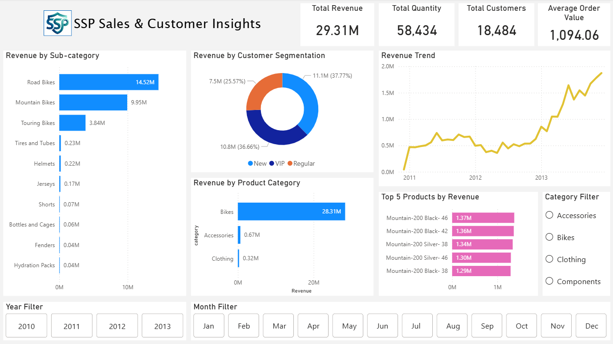
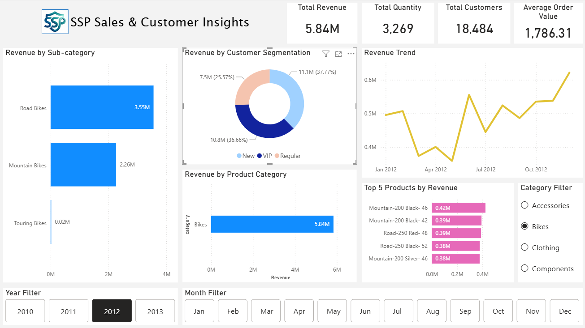
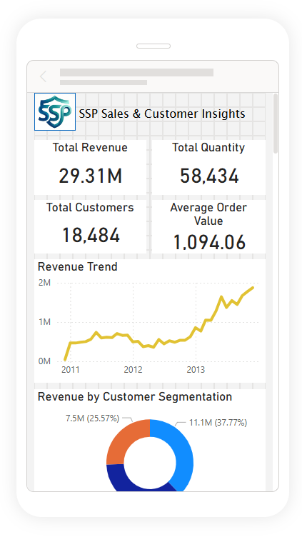
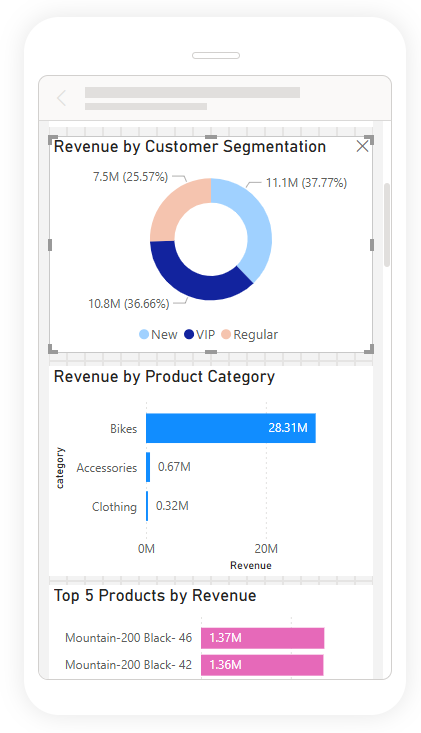

# 📊 Retail Sales Analytics & Customer Segmentation using SQL + Power BI

---

## 📌 Objective
Analyze retail sales data to uncover insights on customer behavior, product performance, and business trends using SQL and visualize them using Power BI.

---

## 🧱 Data Model
- Fact Table: fact_sales  
- Dimension Tables: dim_customers, dim_products  

---

## ⚙️ Tools & Techniques
- SQL (T-SQL)
- Power BI (Data Modeling, Dashboarding)
- Data Modeling (Fact-Dimension Schema)
- Analytical Querying & KPI Development

---

## 📁 Files
- eda.sql → Exploratory analysis  
- advanced_analysis.sql → Advanced analytics & reporting  

---

## 📈 Key Analysis
- Performed EDA to understand data structure and key business metrics  
- Conducted time-based analysis to identify trends and seasonality  
- Analyzed product and customer performance using ranking techniques  
- Built customer segmentation (VIP, Regular, New) based on lifecycle and spending  
- Developed KPI-driven reporting using reusable SQL views  

---

## 🚀 Advanced Techniques
- Window Functions (LAG, DENSE_RANK, Running Totals)
- Common Table Expressions (CTEs)
- Time-Series Analysis
- Customer & Product Segmentation
- KPI Engineering (AOV, Recency, Monthly Revenue)

---

## 📊 Power BI Dashboard

Dashboard with product category 'Bike', for 'VIP' customers in year 2012.

BI Report on phone

---

## 🔍 Dashboard Highlights
- Built an interactive dashboard to track revenue, customers, and product performance  
- Identified revenue concentration in high-value product categories  
- Observed steady growth trend in sales with seasonal patterns  
- Enabled filtering by year, month, and category for deeper analysis  

---

## 📌 Key Metrics Tracked
- Revenue  
- Quantity Sold  
- Customers  
- Average Order Value (AOV)  

---

## 🔍 Key Insights
- Revenue is concentrated among top-performing products  
- A small segment of customers contributes significantly to total sales  
- Seasonal trends observed in monthly sales patterns  
- Performance varies across product categories  

---

## 🔗 Project Link
https://github.com/projects-Akash/sql-sales-analytics-project
